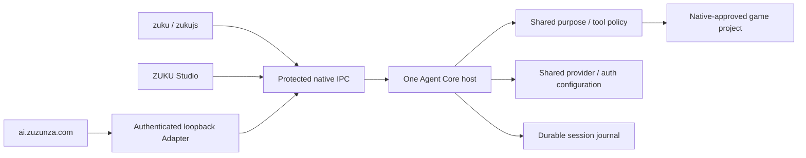

# Shared ZUKU Agent Core and local protocol

`zuku` and `zukujs` use one package entrypoint. CLI, Studio and the Browser Adapter attach to the same per-user Agent Core host; connecting another frontend does not start another game-development task. The browser protocol modules contain no Node, filesystem, provider or authentication imports.



## Public module contract

```js
import { createAgentCore, startCoreHost, createCoreClient } from '../lib/agent-core/index.mjs';
import { createAgentClient, createBrowserClient } from '../lib/agent-protocol/index.mjs';

const native = await createCoreClient(); // attaches or starts the same host
const reply = await native.dispatch({
  protocolVersion: 1,
  id: 'req_open',
  method: 'project.grant',
  params: { localPath: '/user/selected/game', purpose: 'game.maintain' },
});
// No command name is used to choose a state root.
native.close(); // disconnects this client; does not cancel a running session
```

`createAgentCore(options)` returns `dispatch(envelope, actor)`, `subscribe({sessionId,afterSequence,signal}, actor)` and `close()`. `dispatch` returns `{protocolVersion,id,result}` or `{protocolVersion,id,error:{code,action?}}`. Errors never contain provider bodies, credentials, arbitrary messages or stack traces. The typed `createAgentClient({dispatch,subscribe,native})` wrapper exposes `call(method,params)` and `events(params)`.

`createCoreClient(context)` returns the same dispatch/subscribe interface over machine-readable IPC. Its second argument is `{actor}` when a trusted native transport forwards a paired browser actor. The default native actor is issued during IPC authentication. An HTTP request body cannot set an actor, mark itself native or grant a filesystem path. `createStudioHostContext` supplies one such connection to the native inherited-pipe host and Browser Adapter; neither frontend creates its own provider runtime or session controller.

The Browser Adapter must forward authenticated RPC requests to this interface and stream `core.subscribe` directly. It must not own another session controller or event sequence. The existing `X-Zuku-Protocol` and `X-Zuku-Request-Id` headers remain the browser transport headers. The browser-safe client uses `/v1/rpc` and `/v1/sessions/:id/events?afterSequence=N`; native pairing approval remains the Adapter/Studio responsibility. Tokens are held in the browser client closure only. Requests use `credentials:'omit'`, `redirect:'error'` and loopback targeting; a generic fetch failure reports an unavailable connection, not proof that software is missing.

Closed methods are declared in `lib/agent-protocol/schema.mjs`. They cover approved projects, file views and bounded patches/search, sessions, provider/model metadata and settings, native authentication requests, registered previews and Studio opening. There is no shell, process command, arbitrary executable, URL proxy or `/exec` method. Browser `project.grant` and provider endpoint/configuration mutations require native authority. Browser login/logout requires a decision on the captured native prompt connection.

## ADR: one protected host instead of independent frontend runtimes

Status: implemented native host and transport; desktop/browser composition is integrated by the shared host facade.

A factory imported into several processes would still create independent controllers and tasks. The selected design owns them in one host under the existing ZukuJS state root: `~/.config/zukujs/core` or `%LOCALAPPDATA%\ZukuJS\core`. This reuses the established product state identity; it never creates a separate `~/.zuku` state tree. Provider/auth stores remain the existing provider/account modules, and game receipts remain project `.zukujs/agent` receipts.

POSIX uses an owner-only directory, a `0600` Unix socket and a random authenticated IPC key in a checked private file. Existing parent symlinks, unsafe owners/modes, hardlinked files and replaced directory/file identities fail closed. The host has an exclusive live-process lock; dead local process locks may be reclaimed, while a live lock is never stolen by a timeout. Windows uses the existing CurrentUser DPAPI/SID ACL helper for persistent sensitive state and an authenticated named pipe derived from the per-user state path. There is no plaintext credential fallback. Windows native behavior requires Windows execution verification; Linux tests do not establish that evidence.

The trade-off is one local daemon lifecycle and version boundary instead of four duplicated configurations and agent loops. Closing a frontend only detaches its subscriptions. Explicit `session.cancel` aborts the actual run. Host shutdown aborts work, flushes terminal journal/state and preserves interrupted receipts. A crash marks unfinished sessions interrupted on restart and never automatically retries an inference, tool mutation or uncertain production publication.

## ADR: opaque project authority and runtime admission

Status: implemented authority boundary; scope tooling is delegated to the existing shared scope modules.

Native project selection canonicalizes an actual user-owned directory, rejects symlink components and records its device/inode. Public results expose only an opaque `project_…` handle and label. A browser actor contains only transport-issued approved handles and the exact official origin. Each filesystem operation rechecks project identity; providers do not choose tool authority. Session views/cancellation still work if the folder disappears, because cancelling a running task does not require filesystem access.

Workspace classification and request-purpose admission are provided by `lib/agent/scope/index.mjs`. Admission must explicitly return `admitted:true`; a false/reject result is not success even when it does not throw. An empty parent can be approved natively for `game.init`. This does not let a model overwrite an existing project or treat an arbitrary workspace as a game project. Missing policy/tool exports return an unavailable capability rather than executing an unrestricted fallback.

Provider selection is resolved once per run through the shared `createProviderRuntime`, using the selected address/auth method. Next inputs read current persisted provider configuration. Browser/provider metadata never carries API keys, account tokens, environment dumps or custom authorization values. Browser JSON cannot submit a key or borrow unrelated credentials.

## Native authentication sideband

`await client.attachNativePrompter(callback)` registers one authenticated native connection and returns an asynchronous detach function. The callback receives `(request,{signal})`. A second connection cannot replace the owner, answer its questions or redirect an accepted job's secrets. The host captures the owner once for the whole job; disconnect/detach cancels that job's unresolved questions. This cancellation does not cancel unrelated game-development sessions.

Private prompt metadata is `{id,kind,providerId,authMethodId,official,experimental,title,expiresAt,...}`. `secret` accepts `{value}` or `{cancelled:true}`; `decision` accepts `{approved}`; `device-authorization` adds a verified ZUKU URL/user code and accepts `{acknowledged:true}`; `authorization-url` adds a verified Codex PKCE URL and uses the same acknowledgement. The IPC reply is bounded and accepted only from the registered connection with the matching pending ID. Questions expire within 120 seconds, authentication jobs within 15 minutes; there is one active auth job and at most 32 safe retained statuses.

`auth.request` returns `{accepted:true,authRequestId,...}` immediately. The Core calls the existing `ProviderRuntime.authLogin` using the original SecretStore, ZUKU device login (`--generate --no-browser`) or the own-store experimental Codex OAuth flow. It does not run another agent or use another frontend's credentials. `auth.list.requests` reports safe completed/failed/cancelled status to the originating browser actor and all native clients. Successful changes update shared configuration revisions. Codex and other unofficial methods require explicit experimental opt-in; their metadata drives the `(exp!)` display.

`studio-stdio.mjs` translates these requests to private `native.auth` frames consumed by GTK. Secret values return only through `native.authResponse`; pairing decisions use a separate `native.pairingDecision` channel. The native C shell consumes absolute picker paths and preview URLs before renderer forwarding. Auth URLs, user codes, credential values and private picker paths never enter public subscriptions, project results, the journal or renderer messages. The native pipe itself is the machine entrypoint `node lib/studio-host.mjs --stdio`, bounded at 64 KiB incoming and 256 KiB outgoing per frame.

## Read-only native previews

`game.preview`/`game.run` register the actual validated source snapshot; this alone is not evidence that the game executed successfully. `preview.info` returns only the registered entry/version/digest under the existing project grant. `preview.read` returns bounded bytes from that snapshot. The Studio proxy reads those methods over the same Core connection and serves an expiring random `/p/<nonce>/` loopback URL to the native preview view. It has no filesystem, upload, shell or arbitrary URL handler. Nested entries redirect within the same nonce so relative assets retain their project location.

Snapshots retain their bytes when source files change. A newly registered version invalidates older preview URLs. Every served asset is reassembled from bounded Core chunks with a matching version, size and SHA-256. The proxy accepts GET/HEAD only, restricts the host/path, disables caching and supplies a restrictive CSP (including no external connections, workers or frames). No auth/provider RPC is exposed on the preview server.

## ADR: durable bounded events and explicit completion evidence

Status: implemented session journal, replay, bounds and evidence projection.

Every public event is admitted by an exact event schema. Malformed host tool/build transitions fail the run. A monotonically increasing sequence is written and synced before broadcast. Shared scope tooling awaits tool.started/build.started before a file mutation or process launch, and backs up checked originals before replacing source. A rejected durable event prevents that action. POSIX normally appends one record; retention compacts by an atomic synced replacement. A trailing incomplete append from a crash may be discarded, while a malformed complete record fails closed. Windows records use the protected store, with a smaller encrypted retention budget. No missing event is fabricated during reconnect.

Defaults are 2,048 retained events and 4 MiB per session (at most 64 MiB configurable; Windows at most 1 MiB), 32 KiB per record, 8 KiB per visible text/output chunk and 256 KiB per subscriber. A slow subscriber is disconnected with `SLOW_SUBSCRIBER`; the task continues. A cursor outside retention reports `CURSOR_EXPIRED`; the safe session snapshot includes current/minimum sequence. Native transport also bounds connections, pending requests, subscription queues, incoming bodies and drain time.

`session.input` stores a request ID plus a canonical body digest before starting work. The same ID/body returns the existing accepted run. The same ID with different input returns `REQUEST_CONFLICT`. One active writer per approved project is enforced across sessions. Detach/reconnect never resubmits a task.

Public reasoning status is a fixed host phase (`analyzing`, `editing`, `building`, `testing`, `repairing`, `verifying`). Provider reasoning deltas are discarded before history or journaling. Visible provider text uses the same inference stream, a bounded redaction lookbehind and safe chunking. Coarse legacy stage progress is documented as stage progress, not token streaming. Model `agent.completed` events and model claims that tests passed are discarded. A new-game verified result is promoted only after reading its real sandboxed browser receipt and comparing current source/package/skill digests. Maintenance verification must supply equivalent host-owned evidence through the shared scope receipt path; missing evidence remains `verified:false`.

## Validation and remaining integration evidence

The Core/protocol tests exercise actual private files, a real Unix socket, two authenticated native clients, separately spawned Core/Studio processes and inherited pipes, durable restart/replay, request conflicts, opaque browser permissions, slow queues, explicit cancellation, project replacement and secret/reasoning sentinels. Additional integration tests connect the actual loopback Browser Adapter and native pipe to one scoped maintenance run, compare reconnect event sequences, validate/package changed files, store a fixture key through the real SecretStore, cancel the actual own-store Codex callback flow and fetch immutable multi-chunk preview assets. A rejected durable tool-start event is verified to leave actual source unchanged. Model output and native user choices are deliberately fixtures; these are not evidence of live inference, native GUI clicks, service login success or production publication.

The full product additionally needs native GUI/platform execution evidence, real sandbox build/test execution where available and native ZUKU API availability. A passing Core suite does not establish Windows/macOS installation, a live `ai.zuzunza.com` deployment, official native-model token streaming or server production mutation success. Unsupported native ZUKU operations must remain explicit errors until the canonical server supplies their actual contract.
